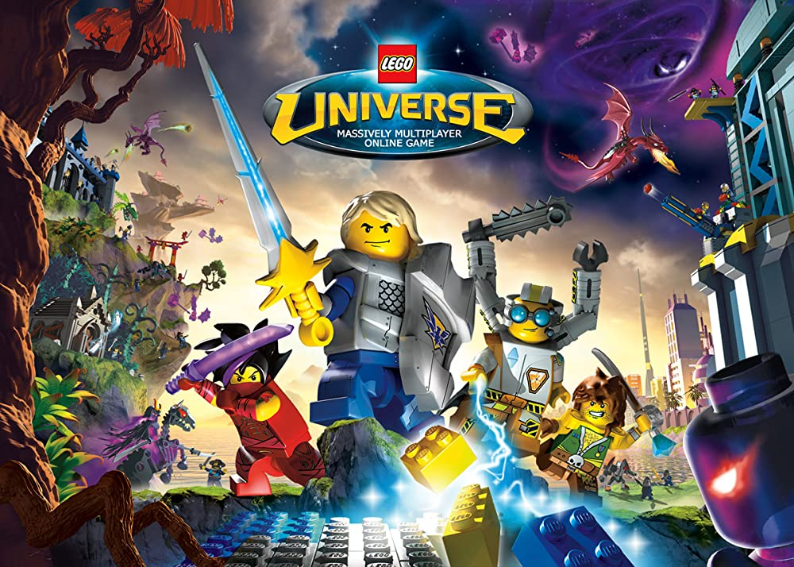

# Awesome Lego Universe

> A curated list of awesome things related to LEGO Universe.

LEGO Universe was a kid-friendly massively-multiplayer online role playing game (MMORPG), developed by The LEGO Group, which was available to players between October 2010 and January 2012. It featured a variety of minigames such as racing, a player housing system that allowed players to build with LEGO bricks, and action-packed combat against the Maelstrom to help save Imagination.

On December 5th, 2021, the Darkflame Universe project released an open-source server emulator for LEGO Universe, which makes the original game fully playable for small groups of friends.

## Guides

* [Frequently Asked Questions](frequently-asked-questions.md)
* [Verify My Client (Checksums)](verify-my-client.md)

### Server Setup Guides

Curated Guides:

* [Server Setup Guide (Google Cloud)](google-cloud-setup.md)
* [Server Setup Guide (Windows)](native-windows-setup.md)
* [Server Setup Guide (Windows with WSL)](wsl-setup.md)
* [The Mythran's Bible - A Server Operator's Guide to Darkflame Universe](mythrans-bible.md)

Other Guides:

* https://github.com/maxdelayer/DLUQuickstart
* https://gist.github.com/SunFlea/893fd80f39c7cf9ab31baacac284025d
* https://github.com/Drahsid/DarkflameServerInstallScript

## Community

* [/r/LEGOUniverse on Reddit](https://old.reddit.com/r/legouniverse/)
* [LEGO Universe Community Hub on Discord](https://discord.com/invite/tWTAa7f)

## Development

* [DarkflameUniverse on GitHub](https://github.com/DarkflameUniverse)
* [LEGO Universe Technical Documentation](https://docs.lu-dev.net/en/latest/)
  - Describes everything known about the inner workings of the game, including the Behavior and Skill systems.
* [LU Explorer tool](https://github.com/Xiphoseer/lu-explorer)
  - Allows you to browse the contents of `CDClient.fdb`.
* [LU Developer Network](https://lu-dev.net/)
* [LU Server Projects](https://lusprojects.github.io/)

## Contributions

Contributions are greatly welcomed, and can be done by submitting a pull request. [Click here for a guide on how to do this](https://docs.github.com/en/repositories/working-with-files/managing-files/editing-files#editing-files-in-another-users-repository).

## Licensing

The guides available in this repository are subject to the Creative Commons CC0 license.
