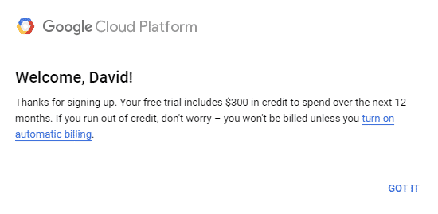

# Setup Instructions for Darkflame Universe (Google Cloud Setup)

The following is a guide to setting up a functioning Darkflame Universe server instance running in the cloud, which has several key benefits:

- These steps don't vary based on what kind of computer you have. They're the same regardless if your home computer runs Windows, Mac, or Linux.
- You can easily start over if you mess up (just delete the instance and create a new one).
- You can easily change the server's settings and manage it from anywhere.
- The server can continue to run even if you turn off your PC.

The downside to this method is that it does technically cost money. You may have to provide a payment method with Google. However, there is a one-year trial which gives $300 in credits, and the smallest instance is only about $5 a month.

## WORK IN PROGRESS

## Table of Contents

1. [Setup Client Files](#setup-client-files)
2. [Unpack Client Files](#unpack-client-files)
3. [Setup Resource Directory](#setup-resource-directory)

## Setup Client Files

The first step in this process is setting up your client files. You will need a Lego Universe 1.10.64 client before continuing. Note that a link to a client cannot be provided in this guide for legal reasons, but Google should be able to help you.

Once you've obtained a client, [make sure it is good by validating the checksum](verify-my-client.md).

## Unpack Client Files

If you downloaded an unpacked client, you may skip this section and move onto [creating the server 'res' directory](#setup-resource-directory).

Darkflame Universe requires an unpacked client, both for setup and for play. An unpacked client can be distinguished by containing extra files and folders in the `res` folder in the client, such as the `macros`, `names`, `maps`, and `scripts`.

If these folders are missing, you will need to extract them from the client resource data.

**TODO: Write really easy instructions on running [pkextractor](https://github.com/lcdr/utils/blob/master/utils/pkextractor.pyw)**

## Setup Resource Directory

Once you have an unpacked client, you will need to retrieve several files from it, that the DLU server needs in order for it to work. Create a folder called `server-resources` somewhere easy to remember, and follow these steps:

* Create a folder called `res`.
* Copy the `LEGO Universe/res/macros` folder into the `res` folder in your resource directory.
* Copy the `LEGO Universe/res/BrickModels` folder into the `res` folder in your resource directory.
* Copy the `LEGO Universe/res/names` folder into the `res` folder in your resource directory.
* Copy the `LEGO Universe/res/maps` folder into the `res` folder in your resource directory.
* Copy the `LEGO Universe/res/chatplus_en_us.txt` file into the `res` folder in your resource directory.
* Copy the `LEGO Universe/res/cdclient.fdb` folder into the `res` folder in your resource directory.
* Create a folder called `locale`.
* Copy the `LEGO Universe/locale/locale.xml` file  into the `locale` folder in your resource directory.

You should have a directory containing the following file structure.

```
|
|-res
  |-macros
    |- ...
  |-BrickModels
    |- ...
  |-names
    |- ...
  |-maps
    |-navmeshes
      |- ...
    |- ...
  |-chatplus_en_us.txt
  |-cdclient.fdb
|-locale
  |-locale.xml
```

Finally, right click your `server-resources` folder, and select 'Send to...' > 'Compressed Folder'. This will compress the folder into a single ZIP file. You will need this ZIP file later.

## Getting Started with Google Cloud

Google makes it very easy to set up a server instance in the cloud. First, [sign up for an account with Google Cloud](https://cloud.google.com/). You should see this popup to let you know you've received $300 in trial credits:



Then, you can access your cloud account from the [Google Cloud Console](https://console.cloud.google.com/). Google has a LOT of powerful tools and resources, but most of them are designed for larger businesses and not relevant to this guide, so don't get overwhelmed.

Click on the `Compute Engine` tab, and then click on the `Create Instance` button to create a new VM instance.

* Name it if you like. The default regon and zone are fine.
* Select the machine type. The default is a 2-core, 4GB memory machine, which is way overkill for what we want. Select the series N1, machine type `f1-micro`, which at time of writing is currently priced at $4.88/month or $0.01/hour. Even this is more than what you need for a DLU server but smaller instances aren't available.
* Scroll to the bottom and click Create.

Once the instance is ready, click it, then click SSH to connect to your instance. You will then see a browser window containing a terminal.

Congratulations! What you've essentially done is reserve a tiny spot on Google's massive server farm, and created a Linux computer in it. We're going to build and install Darkflame Universe on here, and you and your friends will be able to connect and play the game.

## Setup the MySQL Database

Once you've opened the terminal, run these commands, one at a time, in order.

```
# Install almost every dependency we need.
sudo apt-get update
sudo apt-get install -y python3 python3-pip build-essential gcc libssl-dev zlib1g zlib1g-dev sqlite git gpg wget unzip

# This installs MariaDB
sudo apt-get install -y default-mysql-server

# Install the latest cmake
sudo apt remove -y --purge --auto-remove cmake
pip3 install cmake --upgrade
export PATH="$HOME/.local/bin:$PATH"

# Allocate swap space so we don't run out of memory while building.
sudo fallocate -l 2G /swapfile
sudo chmod 600 /swapfile
sudo mkswap /swapfile
sudo swapon /swapfile
sudo swapon -s

sudo mysql -u root
```

The last command will start a MariaDB shell. Enter the following commands one at a time (be sure to change the password on the first line to something more secure):

```
CREATE OR REPLACE USER 'darkflame'@'localhost' IDENTIFIED BY 'password';
CREATE OR REPLACE DATABASE darkflame;
GRANT ALL PRIVILEGES ON darkflame.* TO 'darkflame'@'localhost';
EXIT;
```

You will now have an empty database ready for later.

## Download and Build the Server

Next, run these commands one at a time to download and build the server:

```
git clone --recursive https://github.com/DarkflameUniverse/DarkflameServer ~/DarkflameServer
git clone https://github.com/lcdr/utils.git ~/lcdrutils
git clone https://github.com/DarkflameUniverse/AccountManager ~/AccountManager
cd ~/DarkflameServer
chmod +x build.sh
./build.sh
```

Wait until the build process is complete. This will take a while. In the meantime, you can move on to the next steps. Just don't close the window!

## Upload Resources

Next, we're going to upload the resources folder [we created earlier](#setup-resource-directory) to the proper location. In order to do this in a way that doesn't differ between computers, we're going to create a Google Cloud Storage bucket and upload the files to it.

* Click 'Google Cloud Platform' at the top to move to the Google Cloud homepage.
* Click 'Cloud Storage' on the left.
* Click 'Create Bucket' at the top.
* Pick a name that is easy to remember and easy to type. It needs to be GLOBALLY unique apparently.
* Stick with the defaults for region, storage class, access control, and protection.

Now the bucket is created, you will see the details page for that bucket and a list of objects (i.e. files) in it.

Click 'Upload File', select your `server-resources` ZIP, and click upload. This process should take just a second.

## Configuring the Server's Firewall

Before we get started building the server, we need to configure the server's firewall. Follow these steps:

* Click 'Compute Engine' to move back to the Compute Engine homepage.
* Under Related Actions, click 'Set up Firewall rules'
* Click 'Create Firewall Rule' at the top.

We're going to create a set of Firewall rules that allow access to the server.

* Set the name to `darkflame-server`.
* Add `darkflame-server` to the list of target tags. We're going to assign this tag to our server later.
* Set the Source IPv4 ranges to `0.0.0.0/0`. This represents all IP addresses, meaning this rule will allow any incoming IP.
* Under Protocols and ports, check `TCP` and enter the string `1001, 2000, 2005, 3000-4000, 5000`. This will allow access to the auth server, master server, chat server, world servers, and account manager.

Now lets assign these rules to the server.

* Move back to the home of your Google Cloud project (which currently contains your cloud instance).
* Click 'Compute Engine'. You should see your `darkflame-instance` listed. Click on it.
* Click 'Edit' at the top.
* Scroll down to 'Network tags' and enter `darkflame-server`.
* Scroll to the bottom and click 'Save'.

## Setup the Server

Once the build is done, we're going to do the final configuration needed for the server.

```
# Initialize the database. You will need to enter the password you chose earlier.
mariadb darkflame -u darkflame -p < ~/DarkflameServer/migrations/dlu/0_initial.sql;

# Download the server-resources.zip file from Google Cloud Storage. Be sure to replace the bucket name.
gsutil cp gs://<BUCKET-NAME>/server-resources.zip ~/server-resources.zip

# Unzip the server-resources.zip and move files to the proper location.
unzip -q ~/server-resources.zip -d ~/server-resources/
mv ~/server-resources/server-resources/* ~/DarkflameServer/build/

# Extract the navmeshes.
unzip ~/DarkflameServer/resources/navmeshes.zip -d ~/DarkflameServer/build/res/maps

# Convert the FDB file to an SQLite file.
python3 ~/lcdrutils/utils/fdb_to_sqlite.py --sqlite_path ~/DarkflameServer/build/res/CDServer.sqlite ~/DarkflameServer/build/res/cdclient.fdb

# Fix the SQLite file.
sqlite3 ~/DarkflameServer/build/res/CDServer.sqlite ".read ${HOME}/DarkflameServer/migrations/cdserver/0_nt_footrace.sql"
sqlite3 ~/DarkflameServer/build/res/CDServer.sqlite ".read ${HOME}/DarkflameServer/migrations/cdserver/1_fix_overbuild_mission.sql"
sqlite3 ~/DarkflameServer/build/res/CDServer.sqlite ".read ${HOME}/DarkflameServer/migrations/cdserver/2_script_component.sql"

# Setup your config files.
sed -i "s/mysql_host=/mysql_host=localhost/g" ~/DarkflameServer/authconfig.ini
sed -i "s/mysql_host=/mysql_host=localhost/g" ~/DarkflameServer/chatconfig.ini
sed -i "s/mysql_host=/mysql_host=localhost/g" ~/DarkflameServer/masterconfig.ini
sed -i "s/mysql_host=/mysql_host=localhost/g" ~/DarkflameServer/worldconfig.ini
sed -i "s/mysql_database=/mysql_database=darkflame/g" ~/DarkflameServer/authconfig.ini
sed -i "s/mysql_database=/mysql_database=darkflame/g" ~/DarkflameServer/chatconfig.ini
sed -i "s/mysql_database=/mysql_database=darkflame/g" ~/DarkflameServer/masterconfig.ini
sed -i "s/mysql_database=/mysql_database=darkflame/g" ~/DarkflameServer/worldconfig.ini
sed -i "s/mysql_username=/mysql_username=darkflame/g" ~/DarkflameServer/authconfig.ini
sed -i "s/mysql_username=/mysql_username=darkflame/g" ~/DarkflameServer/chatconfig.ini
sed -i "s/mysql_username=/mysql_username=darkflame/g" ~/DarkflameServer/masterconfig.ini
sed -i "s/mysql_username=/mysql_username=darkflame/g" ~/DarkflameServer/worldconfig.ini

# Give the server the MySQL password you setup earlier. Make sure to replace PASSWORD with the proper value each time.
sed -i "s/mysql_password=/mysql_password=PASSWORD/g" ~/DarkflameServer/authconfig.ini
sed -i "s/mysql_password=/mysql_password=PASSWORD/g" ~/DarkflameServer/chatconfig.ini
sed -i "s/mysql_password=/mysql_password=PASSWORD/g" ~/DarkflameServer/masterconfig.ini
sed -i "s/mysql_password=/mysql_password=PASSWORD/g" ~/DarkflameServer/worldconfig.ini

```

## Setup the Account Manager

Before we can setup the server, we need to setup and start the account manager. This will provide a web interface for the server to manage accounts, approve usernames, and generate CD keys to give to your friends.

## Updating Darkflame Universe

In the future, updates will be release to DarkflameServer that will include bug fixes and potentially even new features. To update the server, you can run the following commands, in order:

```
# Shut down the server.
**TODO: Shut down the server.**

# Update the server.
cd ~/DarkflameServer
git pull
./build.sh

# Restart the server.
**TODO: Restart the server.**
```

## Troubleshooting

If you have an issue with any of the above steps, visit the link below to review common questions and troubleshooting tips.

[Google Cloud Setup Troubleshooting](google-cloud-troubleshooting.md)